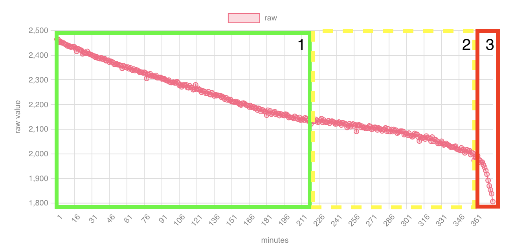

# beepy-battery
simple script to read a corrected battery percentage on the beepy / beepberry

## Motivation
While we can measure the voltage of the beepy's battery within the system  
1) the value is unreliable, it has outliers
2) the voltage is not falling linearly when discharging, so calculating a percentage by using a constant factor gives only limited information about the charge left
3) reading out the voltage every few seconds in a tmux bar at least made the I2C bus hang after a while

As a solution this script will  
1) do a first read out to throw away and then a few more to average them
2) 
	 a) use multiple correction factors for different levels of voltage/charge  
   b) have a safe cutoff point to 0% so that enough charge is left to safely shut down the system
3) cache the result

For 2b) the script will schedule a configurable shutdown of the system when the defined charge level is reached.

The script uses `/sys/firmware/beepberry/battery_raw` if available and fall back to directly read i2c (and temporarily disconnect the keyboard) if not, so it runs on devices with original firmware and with the patched firmware (and module) by excel/aardangelo.

The script can write a log to the user's directory.

## Measurements
This is the discharge graph of my beepy:

As you can see the beepberry runs for about 360 Minutes (375 minutes to be correct) and the raw voltage reported drops from 2465 units[^1] in the first minute to 1806 units.

The discharge seems to have three phases if we consider the raw value reported for voltage:  
1) linearly dropping
2) a phase with a little belly
3) a very steep drop at the end at about 360 minutes when the value reported is below 2000. There's about 15 minute of runtime left. This will be the 0% value for the script.

Reaching phase 3 will be considered as "battery empty" and a shutdown will be triggered. Since the battery is not really empty, there's enough time to warn the user so they can save their work and shut down the system manually.  

## Triggering the script

While the script can be run manually - or it could be scheduled using cron - I gather that most people will use tmux anyways, so I suggest to simply use it in the bottom bar of your tmux configuration.

---
[^1]: Why don't I use proper voltage measurements like 3.7V? Because it makes no sense. We're trusting the charging controller and the battery to cut off charging at the top most level. This is something we have no influence over.    
We can measure the raw value at which the battery (or the charging controller?) cuts off the battery and while we have _some_ influence on this because we can issue a shutdown command, this does not fully turn off the system.
Calculating a voltage from the masurement is not reliable and does not give additional information we can act on.